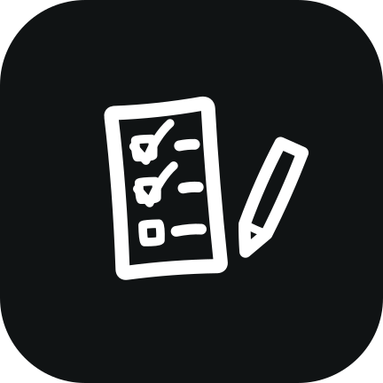

<p align="center">
  
</p>

<h1 align="center">FoundList</h1>

<p align="center">A calm todo app for brains that need less noise, not more.</p>

FoundList is a native Android app (Kotlin + Jetpack Compose) built for ADHD and autistic users - low cognitive load, no gamification, no streaks, no guilt. Just your tasks.

## Features

- **Today** - your open tasks, soonest due first. Search included.
- **Priorities & categories** - organize when it helps, skip it when it doesn't.
- **Due dates & reminders** - real notifications via system alarms, they survive reboots.
- **Recurring tasks** - daily, weekly, monthly. Completing one quietly schedules the next.
- **History** - completed tasks, un-checkable if you change your mind.
- **Material You** - follows your wallpaper colors on Android 12+, calm teal fallback on Android 10/11. Themed icon on Android 13+.

## Tech

- Kotlin, Jetpack Compose, Material 3
- Room for storage - everything stays on your device, no accounts, no network
- AlarmManager + BootReceiver for reliable reminders
- minSdk 29 (Android 10), targetSdk 35

## Building

```
gradle assembleRelease
```

APK lands in `app/build/outputs/apk/release/`. CI builds and attaches an APK to every release.

## License

MIT
